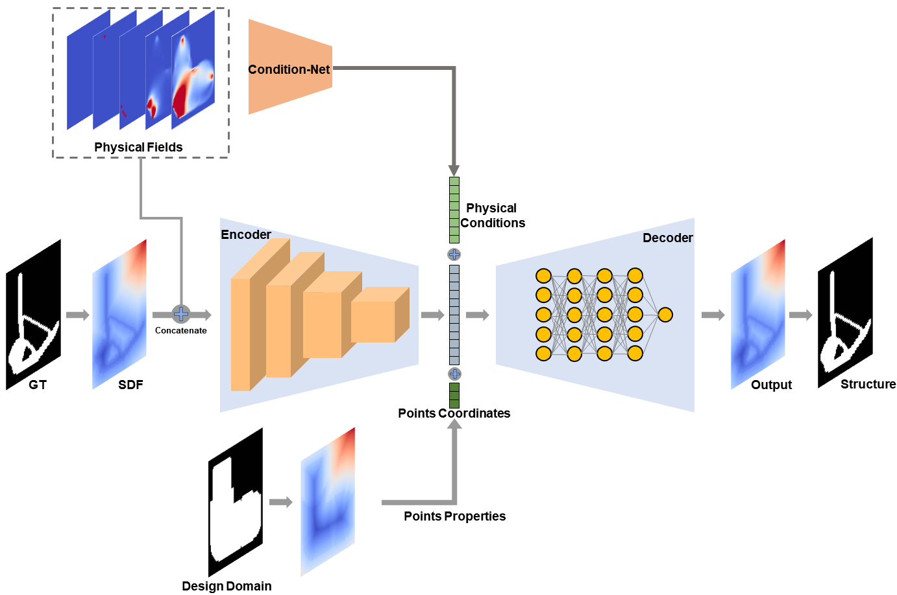

# IF-TONIR
Codes and dataset for paper "IF-TONIR: Iteration-free Topology Optimization based on Implicit Neural Representations"

# Dataset
The code is shared via Google Drive, and the link is provided below.

[https://drive.google.com/file/d/1-65NnqbdrHAEwTLOUUhS_8wbuw8t21wu/view?usp=sharing](https://drive.google.com/file/d/1-65NnqbdrHAEwTLOUUhS_8wbuw8t21wu/view?usp=sharing)

We utilized [Deeplake](https://www.deeplake.ai/) for managing, processing, and loading our data during training process. Please ensure to install it to use our data.
We may consider open-sourcing the raw data for further research in the future.